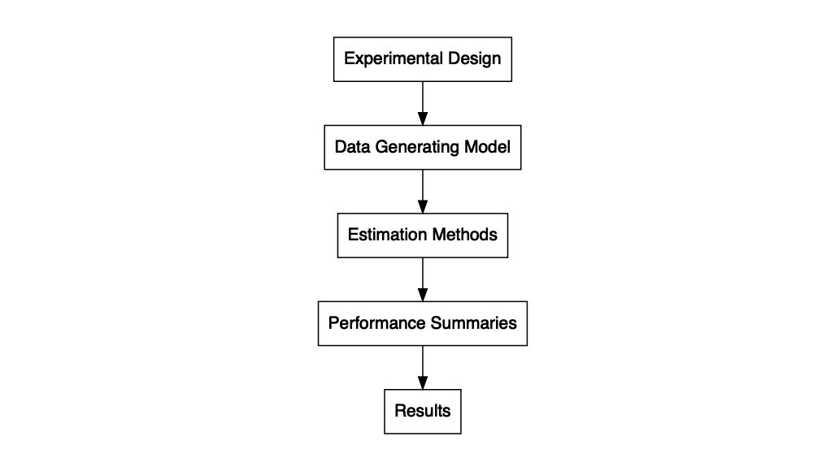
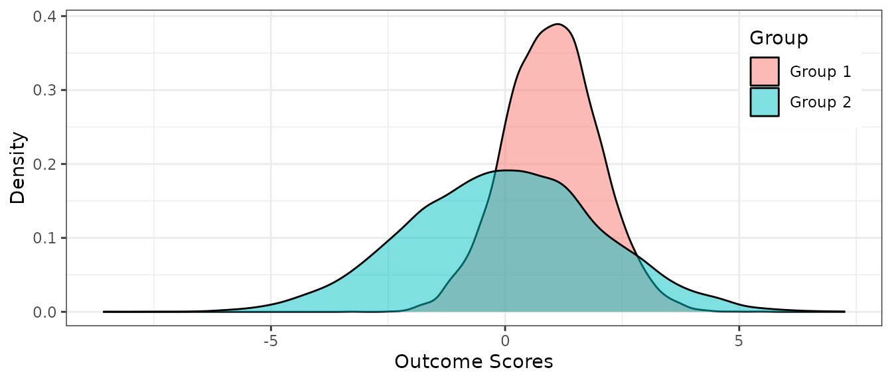

# Simulation Workflow

Simulation studies typically involve the following workflow (Morris,
White, & Crowther, 2019):

1.  Create an experimental design.
2.  Generate a dataset.
3.  Run statistical methods on the dataset.
4.  Run steps 2 and 3 many times, then summarize the performance of the
    statistical methods and calculate MCSE.
5.  Repeat step 4 for every set of conditions in the experimental
    design.
6.  Evaluate the overall results.

The flowchart below depicts the workflow. The chart is created using
`grViz()` from the
[`DiagrammeR`](https://rich-iannone.github.io/DiagrammeR/) package
(Iannone, 2020).



The explanation of the workflow in this vignette follow notes from
Dr. James Pustejovsky’s [Data Analysis, Simulation and Programming in R
course (Spring, 2019)](https://jepusto.com/teaching/daspir/).

``` r

library(simhelpers)
library(dplyr)
library(tibble)
library(purrr)
library(tidyr)
library(knitr)
library(kableExtra)
library(broom)
library(ggplot2)
```

### Initial Experimental Design

Before we begin working on the simulation study, we should decide what
model and design parameters we want to vary. Parameters can include
sample size, proportion of missing data etc.

### Data Generating Model

The data-generating function below takes in model parameters. For
example, we can generate data varying the sample size or level of
heteroskedasticity or the amount of missingness. Below is a skeleton of
the data-generating function. The arguments are any data-generating
parameters that we would want to vary.

``` r

generate_dat <- function(model_params) {

  return(dat)
}
```

Below is an example where we generate random normal data for two groups,
where the second group has a standard deviation twice as large as that
of the first group. The function takes in three arguments: `n1`,
indicating sample size for Group 1, `n2` indicating sample size for
Group 2, and `mean_diff`, indicating the mean difference.

``` r

generate_dat <- function(n1, n2, mean_diff){

  dat <- tibble(
    y = c(rnorm(n = n1, mean_diff, 1), # mean diff as mean, sd 1
          rnorm(n = n2, 0, 2)), # mean 0, sd 2
    group = c(rep("Group 1", n1), rep("Group 2", n2))
  )

  return(dat)

}
```

After creating the data-generating function, we should check whether it
works. Below, we generate an example dataset with 10,000 people in each
group and the `mean_diff` set to 1.

``` r

set.seed(2020143)
example_dat <- generate_dat(n1 = 10000, n2= 10000, mean_diff = 1) 

example_dat %>%
  head()
#> # A tibble: 6 × 2
#>        y group  
#>    <dbl> <chr>  
#> 1  0.491 Group 1
#> 2 -0.534 Group 1
#> 3  1.02  Group 1
#> 4  0.754 Group 1
#> 5  0.762 Group 1
#> 6  0.979 Group 1
```

Below, we create a summary table. The mean of the outcome for Group 1 is
close to 1 and the mean for Group 2 is close to 0. The standard
deviation of the outcome for Group 1 is close to 1 and the standard
deviation for Group 2 is close to 2. The table matches what we specified
in the data-generating model.

``` r

example_dat %>%
  group_by(group) %>%
  summarize(n = n(),
            M = mean(y),
            SD = sd(y)) %>%
  kable(digits = 3)
```

| group   |     n |      M |    SD |
|:--------|------:|-------:|------:|
| Group 1 | 10000 |  0.998 | 0.996 |
| Group 2 | 10000 | -0.014 | 2.028 |

Below we create a density plot of the values that we generated for each
of the groups. The distributions seem normal. The peaks seem to have a
difference of 1. And, the variances of the outcome scores are different
for each group as we specified.

``` r

ggplot(example_dat, aes(x = y, fill = group)) + 
  geom_density(alpha = .5) + 
  labs(x = "Outcome Scores", y = "Density", fill = "Group") + 
  theme_bw() +
  theme(legend.position = c(0.9, 0.8))
```



### Estimation Methods

In this step, we run some statistical methods to calculate test
statistics, regression coefficients, p-values, or confidence intervals.
The function takes in the data and any design parameters, such as
options for how estimation should be carried out (e.g., use HC0 standard
errors or HC2 standard errors).

``` r

estimate <- function(dat, design_params) {

  return(results)
}
```

Below is an example function that runs t-tests on a simulated dataset.
The function runs a conventional t-test, which assumes homogeneity of
variance, and a Welch t-test, which does not assume that the population
variances of the outcome for the two groups are equal. The function
returns a tibble containing the names of the two methods, mean
difference estimates, p-values, and upper and lower bounds of the
confidence intervals. We could use the
[`t.test()`](https://rdrr.io/r/stats/t.test.html) function to extract
everything we need. This function implements the calculations directly
(using sample statistics) mostly just for fun. A further reason is that
the [`t.test()`](https://rdrr.io/r/stats/t.test.html) function does a
lot of extra stuff to handle contingencies that come up with real data
(like missing observations), but which are unnecessary when running
calculations with simulated data.

``` r

# t and p value
calc_t <- function(est, vd, df, method){

  se <- sqrt(vd)  # standard error 
  t <- est / se # t-test 
  p_val <-  2 * pt(-abs(t), df = df) # p value
  ci <- est + c(-1, 1) * qt(.975, df = df) * se # confidence interval
  
  res <- tibble(method = method, est = est, p_val = p_val, 
                lower_bound = ci[1], upper_bound = ci[2])

  return(res)
}


estimate <- function(dat, n1, n2){

  # calculate summary stats
  means <- tapply(dat$y, dat$group, mean)
  vars <- tapply(dat$y, dat$group, var)

  # calculate summary stats
  est <- means[1] - means[2] # mean diff
  var_1 <- vars[1] # var for group 1
  var_2 <- vars[2] # var for group 2

  # conventional t-test
  dft <- n1 + n2 - 2  # degrees of freedom
  sp_sq <- ((n1 - 1) * var_1 + (n2 - 1) * var_2) / dft  # pooled var
  vdt <- sp_sq * (1 / n1 + 1 / n2) # variance of estimate

  # welch t-test
  dfw <- (var_1 / n1 + var_2 / n2)^2 / (((1 / (n1 - 1)) * (var_1 / n1)^2) + ((1 / (n2 - 1)) * (var_2 / n2)^2))  # degrees of freedom 
  vdw <- var_1 / n1 + var_2 / n2 # variance of estimate

  results <- bind_rows(calc_t(est = est, vd = vdt, df = dft, method = "t-test"),
                   calc_t(est = est, vd = vdw, df = dfw, method = "Welch t-test"))


  return(results)

}
```

Here again, it would be good to check if the function runs as it should.
Below we run the `estimate()` function on the example dataset:

``` r

est_res <- 
  estimate(example_dat, n1 = 10000, n2 = 10000) %>%
  mutate_if(is.numeric, round, 5)

est_res
#> # A tibble: 2 × 5
#>   method         est p_val lower_bound upper_bound
#>   <chr>        <dbl> <dbl>       <dbl>       <dbl>
#> 1 t-test        1.01     0       0.967        1.06
#> 2 Welch t-test  1.01     0       0.967        1.06
```

We can compare the results to those from the built-in
[`t.test()`](https://rdrr.io/r/stats/t.test.html) function:

``` r

t_res <- 
  bind_rows(
    tidy(t.test(y ~ group, data = example_dat, var.equal = TRUE)), 
    tidy(t.test(y ~ group, data = example_dat))
  ) %>%
  mutate(
    estimate = estimate1 - estimate2, 
    method = c("t-test", "Welch t-test")
  ) %>%
  select(method, est = estimate, p_val = p.value, lower_bound = conf.low, upper_bound = conf.high) %>%
  mutate_if(is.numeric, round, 5)

t_res
#> # A tibble: 2 × 5
#>   method         est p_val lower_bound upper_bound
#>   <chr>        <dbl> <dbl>       <dbl>       <dbl>
#> 1 t-test        1.01     0       0.967        1.06
#> 2 Welch t-test  1.01     0       0.967        1.06
```

The values match.

#### Convergence Issues

If we were to estimate complicated models, like structural equation
modeling or hierarchical linear modeling, there may be cases where the
model does not converge. To handle such cases, we can add an `if...else`
statement within the `estimate()` function that evaluates whether the
model converged and if it did not converge, the statement outputs `NA`
values for estimates, p-values etc.

``` r

estimate <- function(dat, design_parameters){
  
  # write estimation models here
  # e.g., fit_mimic <- lavaan::cfa(...)
  
  
  # convergence 
  if(fit_mimic@optim$converged == FALSE){  # this syntax will depend on how the specific model stores convergence
    res <- tibble(method = method, est = NA, p_val = NA, 
                  lower_bound = NA, upper_bound = NA)
  } else{
    res <- tibble(method = method, est = est, p_val = p_val, 
                  lower_bound = ci[1], upper_bound = ci[2])
  }
  
  return(res)

}      
```

### Performance Summaries

In this step, we create a function to calculate performance measures
based on results that we extracted from the estimation step, repeated
across many replications. As the skeleton below indicates, a performance
summary function takes in the results, along with any model parameters,
and returns a dataset of performance measures.

``` r

calc_performance <- function(results, model_params) {

  return(performance_measures)
}
```

The function below fills in the `calc_performance()` function. We use
the
[`calc_rejection()`](https://meghapsimatrix.github.io/simhelpers/reference/calc_rejection.md)
function in the `simhelpers` package to calculate rejection rates.

``` r

calc_performance <- function(results) {
  
  performance_measures <- results %>%
    group_by(method) %>%
    group_modify(~ calc_rejection(.x, p_values = p_val))

  return(performance_measures)
}
```

### Simulation Driver

The following code chunk sets up the simulation driver. The arguments
specify the number of iterations for the simulation and any parameters
needed to run the data-generating and estimating functions. The function
then generates many sets of results by repeating the data-generating
step and estimation step. Finally, the function calculates the
performance measures and returns results for this set of parameters.

``` r

run_sim <- function(iterations, model_params, design_params, seed = NULL) {
  if (!is.null(seed)) set.seed(seed)

  results <-
    map_dfr(1:iterations, ~ {
      dat <- generate_dat(model_params)
      estimate(dat, design_params)
    })

  calc_performance(results, model_params)
}
```

Below is the driver for our example simulation study:

``` r

run_sim <- function(iterations, n1, n2, mean_diff, seed = NULL) {
  if (!is.null(seed)) set.seed(seed)

  results <-
    map_dfr(1:iterations, ~ {
      dat <- generate_dat(n1 = n1, n2 = n2, mean_diff = mean_diff)
      estimate(dat = dat, n1 = n1, n2 = n2)
    })
  
  calc_performance(results)

}
```

### Experimental Design Revisit

Now that we have all our functions in order, we can specify the exact
factors we want to manipulate in the study. The following code chunk
creates a list of design factors and uses the
[`expand_grid()`](https://tidyr.tidyverse.org/reference/expand_grid.html)
function from [`tidyr`](https://tidyr.tidyverse.org/) package to create
every combination of the factor levels. We also set the number of
iterations and the seed that will be used when generating data (Wickham
et al., 2019).

``` r

set.seed(20150316) # change this seed value!

# now express the simulation parameters as vectors/lists

design_factors <- list(factor1 = , factor2 = , ...) # combine into a design set

params <-
  tidyr::expand_grid(!!!design_factors) %>%
  mutate(
    iterations = 1000,  # change this to how many ever iterations  
    seed = round(runif(1) * 2^30) + 1:n()
  )

# All look right?
lengths(design_factors)
nrow(params)
head(params)
```

The code below specifies three design factors: `n1`, which specifies the
sample size for Group 1, `n2`, which specifies the sample size for Group
2, and `mean_diff`, which denotes the mean difference between two groups
on an outcome. These are the between simulation factors. The
within-simulation factor is the t-test method with one assuming equal
variance and one not assuming equal variance.

``` r

set.seed(20200110)

# now express the simulation parameters as vectors/lists

design_factors <- list(
  n1 = 50,
  n2 = c(50, 70),
  mean_diff = c(0, .5, 1, 2)
)
params <-
  tidyr::expand_grid(!!!design_factors) %>%
  mutate(
    iterations = 1000,
    seed = round(runif(1) * 2^30) + 1:n()
  )


# All look right?
lengths(design_factors)
#>        n1        n2 mean_diff 
#>         1         2         4
nrow(params)
#> [1] 8
head(params)
#> # A tibble: 6 × 5
#>      n1    n2 mean_diff iterations      seed
#>   <dbl> <dbl>     <dbl>      <dbl>     <dbl>
#> 1    50    50       0         1000 204809087
#> 2    50    50       0.5       1000 204809088
#> 3    50    50       1         1000 204809089
#> 4    50    50       2         1000 204809090
#> 5    50    70       0         1000 204809091
#> 6    50    70       0.5       1000 204809092
```

### Running the Simulation in Serial

Here we run the simulation using `purrr` package serial workflow. We use
the [`pmap()`](https://purrr.tidyverse.org/reference/map2.html) function
from `purrr` to run the `run_sim()` function on each condition specified
in `params`.

``` r

system.time(
  results <- 
    params %>%
    mutate(
      res = pmap(., .f = run_sim)
    ) %>%
    unnest(cols = res)
)
#>    user  system elapsed 
#>  23.457   0.000  23.460

results %>%
  kable()
```

| n1 | n2 | mean_diff | iterations | seed | method | K_rejection | rej_rate | rej_rate_mcse |
|---:|---:|---:|---:|---:|:---|---:|---:|---:|
| 50 | 50 | 0.0 | 1000 | 204809087 | Welch t-test | 1000 | 0.047 | 0.0066926 |
| 50 | 50 | 0.0 | 1000 | 204809087 | t-test | 1000 | 0.048 | 0.0067599 |
| 50 | 50 | 0.5 | 1000 | 204809088 | Welch t-test | 1000 | 0.358 | 0.0151603 |
| 50 | 50 | 0.5 | 1000 | 204809088 | t-test | 1000 | 0.362 | 0.0151972 |
| 50 | 50 | 1.0 | 1000 | 204809089 | Welch t-test | 1000 | 0.860 | 0.0109727 |
| 50 | 50 | 1.0 | 1000 | 204809089 | t-test | 1000 | 0.861 | 0.0109398 |
| 50 | 50 | 2.0 | 1000 | 204809090 | Welch t-test | 1000 | 1.000 | 0.0000000 |
| 50 | 50 | 2.0 | 1000 | 204809090 | t-test | 1000 | 1.000 | 0.0000000 |
| 50 | 70 | 0.0 | 1000 | 204809091 | Welch t-test | 1000 | 0.050 | 0.0068920 |
| 50 | 70 | 0.0 | 1000 | 204809091 | t-test | 1000 | 0.028 | 0.0052169 |
| 50 | 70 | 0.5 | 1000 | 204809092 | Welch t-test | 1000 | 0.416 | 0.0155867 |
| 50 | 70 | 0.5 | 1000 | 204809092 | t-test | 1000 | 0.339 | 0.0149693 |
| 50 | 70 | 1.0 | 1000 | 204809093 | Welch t-test | 1000 | 0.941 | 0.0074511 |
| 50 | 70 | 1.0 | 1000 | 204809093 | t-test | 1000 | 0.906 | 0.0092284 |
| 50 | 70 | 2.0 | 1000 | 204809094 | Welch t-test | 1000 | 1.000 | 0.0000000 |
| 50 | 70 | 2.0 | 1000 | 204809094 | t-test | 1000 | 1.000 | 0.0000000 |

### Running the Simulation in Parallel

Below we use the
[`future`](https://rstudio.github.io/promises/articles/futures.html) and
the [`furrr`](https://furrr.futureverse.org/) packages to run the
simulation in parallel (Bengtsson, 2020; Vaughan & Dancho, 2018). These
packages are designed to work with functions from the `purrr` package.
The line below gets a cluster set up on your computer or network. For
more complicated network setups, please see the [documentation for the
future
package](https://rstudio.github.io/promises/articles/futures.html).

``` r

plan(multisession)
```

Once the cluster is configured, we can just replace
[`pmap()`](https://purrr.tidyverse.org/reference/map2.html) from `purrr`
with
[`future_pmap()`](https://furrr.futureverse.org/reference/future_map2.html)
to run the simulation in parallel.

``` r

library(future)
library(furrr)

plan(multisession) # choose an appropriate plan from the future package

system.time(
  results <-
    params %>%
    mutate(res = future_pmap(., .f = run_sim)) %>%
    unnest(cols = res)
)
```

In the `simhelpers` package, we have a function,
[`evaluate_by_row()`](https://meghapsimatrix.github.io/simhelpers/reference/evaluate_by_row.md),
that implements this `furrr` workflow automatically:

``` r

plan(multisession)
results <- evaluate_by_row(params, run_sim)
```

## Example from simhelpers

The
[`create_skeleton()`](https://meghapsimatrix.github.io/simhelpers/reference/create_skeleton.md)
function from our `simhelpers` package will open an untitled .R file
with an outline or skeleton of functions needed to run a simulation
study.

``` r

create_skeleton()
```

## References

Bengtsson, H. (2020). *Future: Unified parallel and distributed
processing in r for everyone*. Retrieved from
<https://CRAN.R-project.org/package=future>

Iannone, R. (2020). *DiagrammeR: Graph/network visualization*. Retrieved
from <https://CRAN.R-project.org/package=DiagrammeR>

Morris, T. P., White, I. R., & Crowther, M. J. (2019). Using simulation
studies to evaluate statistical methods. *Statistics in Medicine*,
*38*(11), 2074–2102.

Vaughan, D., & Dancho, M. (2018). *Furrr: Apply mapping functions in
parallel using futures*. Retrieved from
<https://CRAN.R-project.org/package=furrr>

Wickham, H., Averick, M., Bryan, J., Chang, W., McGowan, L. D.,
François, R., … Yutani, H. (2019). Welcome to the tidyverse. *Journal of
Open Source Software*, *4*(43), 1686.
<https://doi.org/10.21105/joss.01686>
