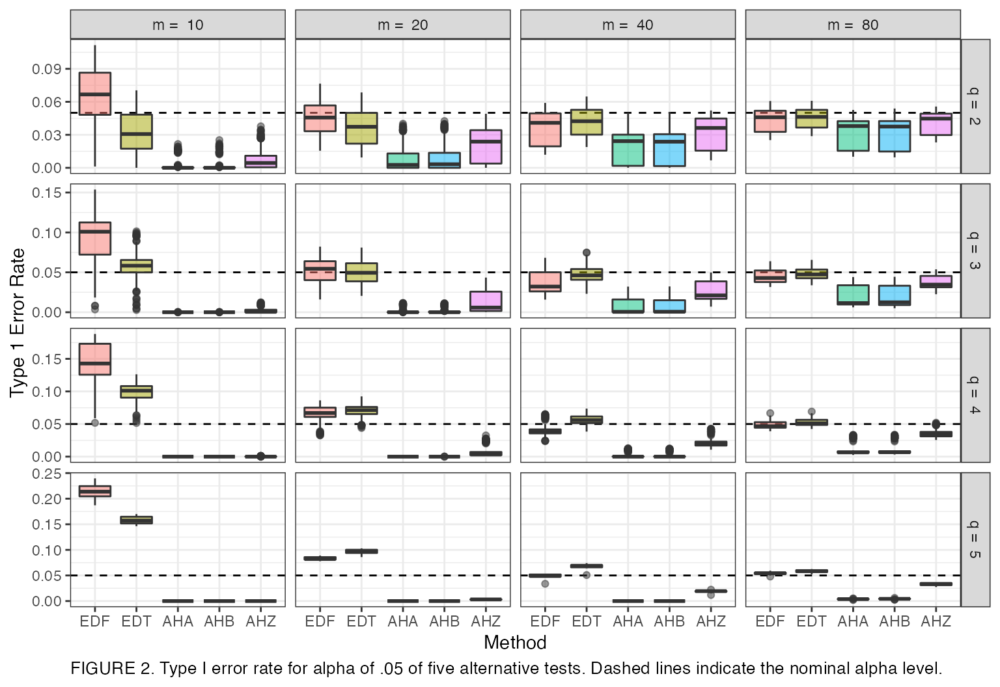

# Presenting Results from Simulation Studies

### Introduction to Tipton & Pustejovsky (2015)

In this vignette, we provide a brief example of how to present and
report results from a simulation study. We replicate Figure 2 of Tipton
& Pustejovsky (2015), which examined several small sample corrections
for robust variance estimation methods as used in meta-analysis.

Meta-analysis is a set of statistical tools for synthesizing results
from multiple primary studies on a common topic. Three major goals of
meta-analysis include summarizing the results across the studies using
some form of an effect size measure, characterizing the amount of
variation in effects, and explaining variation in effect sizes (Hedges,
Tipton, & Johnson, 2010). Primary studies often report multiple
estimates of effect sizes resulting from multiple correlated measures of
an outcome, repeated measures of outcome data or the comparison of
multiple treatment groups to the same control group (Hedges et al.,
2010). These scenarios result in statistical dependence between effect
sizes from the same study. However, typical methods to conduct
meta-analysis, such as averaging effect sizes or analyzing moderating
effects with meta-regression, involve an assumption that each effect
size is independent. Use of such methods that ignore dependence can
result in inaccurate standard errors and therefore, hypothesis tests
with incorrect Type 1 error rates and confidence intervals with
incorrect coverage levels (Becker, 2000).

One alternative, using a multivariate model, explicitly models
correlations among effect size estimates (Hedges et al., 2010; Tipton,
2015). However, multivariate meta-analysis requires knowledge of
correlations or covariances between pairs of effect sizes within each
primary study which are often difficult to obtain (Olkin & Gleser,
2009). Hedges et al. (2010) proposed the use of robust variance
estimation (RVE) to handle dependent effect sizes. RVE does not require
knowledge of the covariance structure between effect sizes like
multivariate analyses. Instead, RVE estimates the variances for the
meta-regression model’s coefficients using sandwich estimators (Hedges
et al., 2010; Tipton, 2015). RVE is increasingly being used in applied
meta-analyses (Tipton, 2015). However, the performance characteristics
of RVE are asymptotic in that it requires a large number of clusters
(studies) to provide accurate standard errors (Cameron, Gelbach, &
Miller, 2008; Tipton, 2015). If the number of studies in a meta-analysis
is small, basic RVE can result in downwardly biased standard errors and
inflation of Type 1 error rates (Cameron et al., 2008; Hedges et al.,
2010; Tipton, 2015). Tipton (2015) and Tipton & Pustejovsky (2015)
introduced small sample corrections for RVE for tests of single
coefficients and for multiple contrast hypotheses, respectively. Tipton
& Pustejovsky (2015) studied five methods, two based on eigen
decomposition and three based on Hotelling’s $T^{2}$ distribution. The
authors recommended a method (AHZ) which approximates the test statistic
using Hotelling’s $T^{2}$ distribution with degrees of freedom proposed
by Zhang (2012) and Zhang (2013). This method resulted in Type 1 error
rates closest to the nominal rate of .05. However, AHZ was shown to
still have below nominal Type 1 error rates for tests of multiple
contrast hypotheses.

### The Tipton_Pusto Dataset

The `simphelpers` package includes a dataset, `Tipton_Pusto`, containing
a subset of the simulation results from Tipton & Pustejovsky (2015).
Specifically, the dataset contains results to replicate Figure 2 from
the article.

``` r
library(simhelpers)
library(ggplot2)
library(dplyr)
library(knitr)
library(kableExtra)
```

The dataset contains:

- `num_studies`: number of studies contained in each meta-analysis used
  to generate the data.
- `r`: the correlation between outcomes that result in dependence.
- `Isq`: a measure of heterogeneity of true effects.
- `contrast`: type of contrast that was tested.
- `test`: small sample method used. EDF and EDT are the two methods
  using eigen decomposition and AHA, AHB and AHZ are the three methods
  based on Hotelling’s $T^{2}$ distribution.
- `q`: the number of parameters in the hypothesis test.
- `rej_rate`: Type 1 error rate with the value for nominal $\alpha$ set
  to .05.
- `mcse`: The Monte Carlo standard error for the Type 1 error rate.

Here is a glimpse of the dataset:

``` r
glimpse(Tipton_Pusto)
#> Rows: 15,300
#> Columns: 8
#> $ num_studies <dbl> 10, 10, 10, 10, 10, 10, 10, 10, 10, 10, 10, 10, 10, 10, 10…
#> $ r           <dbl> 0, 0, 0, 0, 0, 0, 0, 0, 0, 0, 0, 0, 0, 0, 0, 0, 0, 0, 0, 0…
#> $ Isq         <dbl> 0, 0, 0, 0, 0, 0, 0, 0, 0, 0, 0, 0, 0, 0, 0, 0, 0, 0, 0, 0…
#> $ contrast    <chr> "O:2:23", "O:2:23", "O:2:23", "O:2:23", "O:2:23", "O:2:24"…
#> $ test        <fct> AHA, AHB, AHZ, EDF, EDT, AHA, AHB, AHZ, EDF, EDT, AHA, AHB…
#> $ q           <chr> "2", "2", "2", "2", "2", "2", "2", "2", "2", "2", "2", "2"…
#> $ rej_rate    <dbl> 0.0000, 0.0000, 0.0036, 0.0750, 0.0323, 0.0000, 0.0000, 0.…
#> $ mcse        <dbl> 0.0000000000, 0.0000000000, 0.0005989190, 0.0026339134, 0.…
```

### Data Cleaning

Below we clean the dataset for visualization. We add `q =` in front of
the value for $q$ and we add `m =` in front of the value for the number
of studies.

``` r
Tipton_Pusto <- Tipton_Pusto %>%
  mutate(q_graph = paste("q = ", q),
         m = paste("m = ", num_studies))
```

### Visualization

Below we graph the Type 1 error rates. The error rate is mapped onto the
`y axis`, the small sample method is mapped onto the `x axis`, the
method is also mapped as `color filling` so that different methods will
have different colors. We add a dashed line on the nominal $\alpha$
level of .05. We create boxplots to capture the range of Type 1 error
rates for each method across the conditions examined in the simulation.
We facet by number of studies, `m`, and number of parameters used in the
hypothesis test, `q`.

``` r
Tipton_Pusto %>%
  ggplot(aes(x = test, y = rej_rate, fill = test)) + 
  geom_hline(yintercept = .05, linetype = "dashed") + 
  geom_boxplot(alpha = .5) + 
  facet_grid(q_graph ~ m, scales = "free") + 
  labs(x = "Method", y = "Type 1 Error Rate", caption = "FIGURE 2. Type I error rate for alpha of .05 of five alternative tests. Dashed lines indicate the nominal alpha level.") + 
  theme_bw() +
  theme(legend.position = "none",
        plot.caption=element_text(hjust = 0, size = 10))
```



### Interpretation of Results

Here is the write-up of the results from Tipton & Pustejovsky (2015):

> Figure 2 reveals several trends. First, Type I error for the EDF and
> EDT tests typically approach the nominal values from above, whereas
> the AHA, AHB, and AHZ tests approach the nominal values from below.
> This trend holds in relation to both $m$ and $q$. For example, when
> there are 20 studies, as $q$ increases, the Type I error rates of the
> EDF and EDT tests increase to values far above nominal (close to .10),
> while the error rates decrease toward 0 for the AHA, AHB, and AHZ
> tests. For each value of $q$, the error rates of all five tests
> converge toward the nominal values as the number of studies increases.

> Second, the EDF and EDT tests have Type I error rates that cover a
> wide range of values across the parameters and hypothesis
> specifications under study (as indicated by the long whiskers on each
> box). Because it is not possible to know a priori in which design
> condition a particular analysis will fall, it makes more sense to
> compare the maximum Type I error observed across tests. While the EDT
> and EDF tests have Type I error rates that are closest to nominal on
> average, they also exhibit error rates that are far above nominal
> under a large number of design conditions that cannot be identified a
> priori. In comparison, the AHA, AHB, and AHZ tests are typically more
> conservative and are also nearly always level-$\alpha$, with a maximum
> error rate of 0.059 across all conditions studied. In describing
> further trends, we therefore focus only on the three AH tests.

### Monte Carlo Standard Error

Below we calculate the maximum Monte Carlo standard error (MCSE) for
each of the methods presented in the graph above. Ideally, MCSE values
should be relatively small compared to the estimated Type 1 error rates.
Overall, the maximum MCSEs are small compared to the range of reported
rejection rates.

``` r
Tipton_Pusto %>%
  group_by(test) %>%
  summarize(mcse = max(mcse)) %>%
  kable(digits = 4)
```

| test |   mcse |
|:-----|-------:|
| EDF  | 0.0043 |
| EDT  | 0.0038 |
| AHA  | 0.0022 |
| AHB  | 0.0023 |
| AHZ  | 0.0023 |

## References

Becker, B. J. (2000). Multivariate meta-analysis. In *Handbook of
applied multivariate statistics and mathematical modeling* (pp.
499–525). Elsevier.

Cameron, A. C., Gelbach, J. B., & Miller, D. L. (2008). Bootstrap-Based
Improvements for Inference with Clustered Errors. *The Review of
Economics and Statistics*, 47.

Hedges, L. V., Tipton, E., & Johnson, M. C. (2010). Robust variance
estimation in meta-regression with dependent effect size estimates.
*Research Synthesis Methods*, *1*(1), 39–65.
<https://doi.org/10.1002/jrsm.5>

Olkin, I., & Gleser, L. (2009). Stochastically dependent effect sizes.
*The Handbook of Research Synthesis and Meta-Analysis*, 357–376.

Tipton, E. (2015). Small sample adjustments for robust variance
estimation with meta-regression. *Psychological Methods*, *20*(3),
375–393. <https://doi.org/10.1037/met0000011>

Tipton, E., & Pustejovsky, J. E. (2015). Small-Sample Adjustments for
Tests of Moderators and Model Fit Using Robust Variance Estimation in
Meta-Regression. *Journal of Educational and Behavioral Statistics*,
*40*(6), 604–634. <https://doi.org/10.3102/1076998615606099>

Zhang, J.-T. (2012). An approximate hotelling T2-test for
heteroscedastic one-way MANOVA. *Open Journal of Statistics*, *2*(1),
1–11.

Zhang, J.-T. (2013). Tests of linear hypotheses in the ANOVA under
heteroscedasticity. *International Journal of Advanced Statistics and
Probability*, *1*(2), 9–24.
